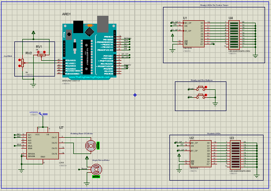
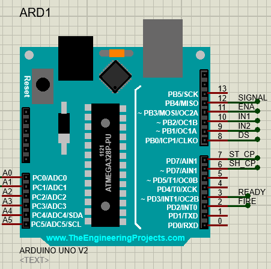
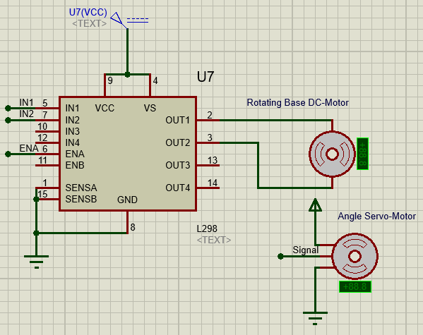
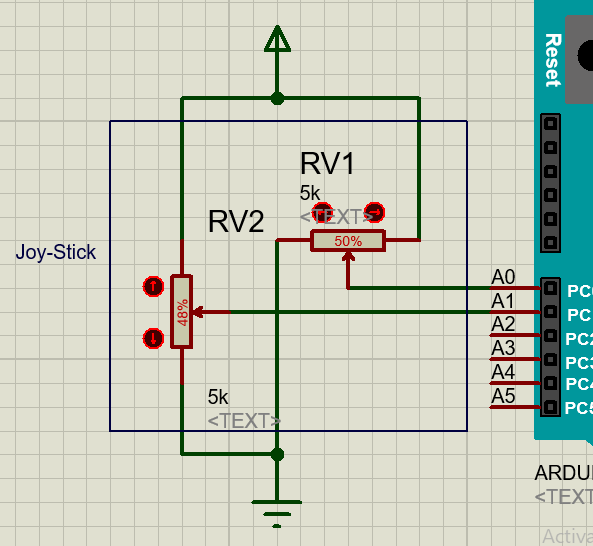
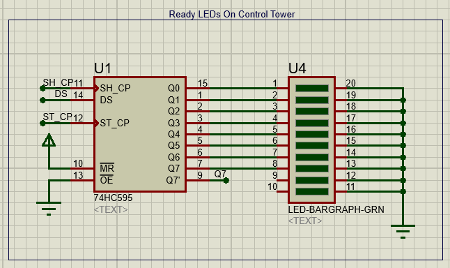
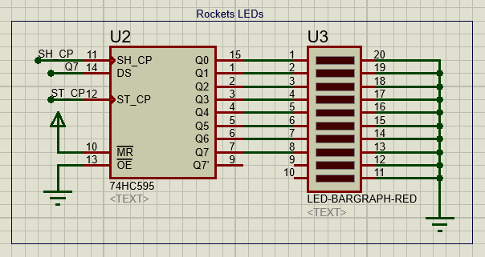
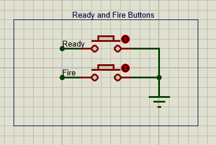

# Air-Defence_Rocket-Base
 A Rocket-Base, simulation by LEDs instead of Rockets, that can rotates 360 degrees  around X-Axis and 77 degrees around Y-Axis. There're button, Joystick, Servo-Motor,  DC-Motor and 16 LEDs (8 Red LEDs & 8 Yellow LEDs).
## Operation:-
- By moving the joystick up and down, the rockets goes up and down, respectively.
- By moving the joystick right and left, the Base rotates right and left, respectively.
- By pressing on the joystick button, a yellow LED will emit light that indicates that the corrosponding rocket is ready to be fired.
- By pressing on the seperate button, a red LED will emit light -only when corrosponding yellow LED emits- that indicates that the corrosponding rocket is fired.
## Design on simulation 

    <figure class="image">
        
        <figcaption>
                Full Design
        </figcaption>
    </figure>

    <figure class="image">
        
        <figcaption>
                Arduino (It will be implemented as arduino nano but in simulation there are problems with analog pins of arduino nano so i used arduino UNO in simulation)
        </figcaption>
    </figure>

    <figure class="image">
        
        <figcaption>
                DC-Motor & Servo-Motor & H-Bridge
        </figcaption>
    </figure>

    <figure class="image">
        
        <figcaption>
                Joy-Stick (There is no Joy-Stick simulation so i replaced it with two potentiometers 5K to act same as behavior of the Joy-Stick)
        </figcaption>
    </figure>

    <figure class="image">
        
        <figcaption>
                Ready LEDs on the Control Tower
        </figcaption>
    </figure>

    <figure class="image">
        
        <figcaption>
                Rockets LEDs on the Rocket-Base
        </figcaption>
    </figure>

    <figure class="image">
        
        <figcaption>
                Ready & Fire Buttons
        </figcaption>
    </figure>

